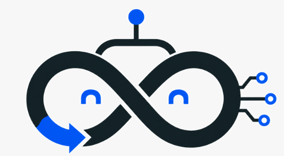

<p align="center">
  
</p>

# Loop ROS

**English** · [简体中文](README.zh-CN.md)

**Loop Robot Operating System — a coding agent with optional robotics tools.**

Loop connects a user-selected model to tools, persistent tasks and robot runtimes. Its central contract is **goal → execute → observe → review → revise**. Execution receipts and task success are recorded separately.

Initial version **0.0.1**. Hosted release delivery and updates are supported; GitHub publication is a separate workflow.

## Quick start

From a source checkout, Python 3.8+ can start the installer. It prepares uv and creates a Python 3.12 `.venv` automatically (reuses an existing Python 3.10+ environment):

```sh
python3 scripts/install.py --terminal-only
loop
```

For the optional MuJoCo environment, use `python3 scripts/install.py`. Interactive startup checks the model connection. Missing keys or failed connections open the `loop-switch setup` wizard: choose a provider or custom URL, API type, hidden key and model. Loop rechecks the saved configuration before opening the conversation. Existing profiles are retained.

**Recommended: GPT-6 Astra through your custom API or OpenAI Responses API.** Use the exact model ID exposed by your endpoint. See [GPT-6 and custom API setup](docs/QUICK_SETUP.md); configuring a model does not verify account access or tool support. Other compatible providers remain supported.

If installation reports `Destination already exists` and you want commands to use this checkout, run:

```sh
python3 scripts/install.py --terminal-only --replace-launchers
```

This backs up conflicting launchers as `~/.local/bin/<command>.loop-ros-backup.N` after dependencies install successfully, then switches commands to this checkout. Previous checkouts and their data remain intact. Add `--check` to preview; Windows uses `py -3` and backs up `.cmd` launchers. Without this option, conflicting commands are preserved and installation stops.

## Uninstall

Close Loop ROS and its background services, then run from this source checkout using system Python (Python 3.8+):

```sh
python3 scripts/uninstall.py --check  # Preview only
python3 scripts/uninstall.py
```

On Windows, use `py -3 scripts/uninstall.py`. The [uninstaller](scripts/uninstall.py) removes this checkout’s `.venv` and recognized Loop ROS user command launchers, including those pointing at older checkouts. Source, settings, Skills, sessions, runtime data, uv and shared Python installations are retained. Unrelated or unverified launchers, other checkouts’ environments and launcher backups are preserved. PATH entries are retained because the user command directory can contain other tools. A `.venv` symlink/junction is removed without deleting its target; an unrecognized directory is left unchanged.

## Installation by platform

The [website](https://loopmaster.box2ai.com/LoopROS/) defaults to English with a Simplified Chinese option; Docs links to this repository README.

Start with an OS-compatible Python 3.8+; the installer uses uv to prepare an isolated Python 3.12 runtime without replacing system Python. These commands install the terminal edition; omit `--terminal-only` to include optional simulation dependencies.

### Linux

```sh
curl -fsSL https://loopmaster.box2ai.com/LoopROS/install.sh | sh -s -- --terminal-only
```

### macOS (Intel / Apple Silicon)

```sh
curl -fsSL https://loopmaster.box2ai.com/LoopROS/install.sh | sh -s -- --terminal-only
```

### Windows 10/11 — PowerShell

```powershell
Invoke-WebRequest -Uri https://loopmaster.box2ai.com/LoopROS/install.ps1 -OutFile loop-install.ps1 -ErrorAction Stop
powershell -NoProfile -ExecutionPolicy Bypass -File .\loop-install.ps1 --terminal-only
```

### Windows 10/11 — CMD

```bat
curl.exe -fSLo loop-install.ps1 https://loopmaster.box2ai.com/LoopROS/install.ps1 && powershell -NoProfile -ExecutionPolicy Bypass -File .\loop-install.ps1 --terminal-only
```

### Older systems — SSH

On Windows 7/8 or systems unable to run the required Python, use a compatible SSH client to connect to a host with Loop ROS installed. Replace `USER` and `HOST`:

```sh
ssh -t USER@HOST '$HOME/.local/bin/loop'
```

SSH does not include local USB/camera forwarding. Linux HTTPS installation is verified; native macOS and Windows installation remains unverified. After installation, reopen the terminal and run `loop` to configure the model connection.

## Updates

```sh
loop update --check
loop update
loop update --rollback
```

Close Loop ROS terminals, background services and viewers before updating. A new runtime is installed and checked before activation; the previous runtime is retained. Configuration, Skills, state and terminal-only selection are preserved. Rollback changes the runtime, not user data. Source installs use `loop update --migrate --terminal-only` to explicitly switch to hosted releases; local source edits remain untouched. See [release details](docs/RELEASES.md).

Uninstall a hosted release with `curl -fsSL https://loopmaster.box2ai.com/LoopROS/uninstall.sh | sh`; user data and uv are retained.

## User settings, Skills and device migration

Keep personal files in `~/.loop` (`%USERPROFILE%\.loop` on Windows): `config.json`, optional `agents.json` and `task_runtime.json`, `AGENTS.md`, `harness/*.md`, and complete `skills/<name>/` packages. Packaged `configs/` files remain defaults. `LOOP_HOME` selects an alternative user directory.

Model profiles, permission settings and history are in the runtime state directory, so migrating only `~/.loop` does not preserve them. Stop Loop and its background services, then transfer both the user directory and the state directory to the new device. Keep credentials private and restore their permissions; copy whole Skill folders so supporting scripts and references survive. Do not copy the runtime virtual environment between devices. See [storage rules and migration steps](docs/USER_HOME.md#device-migration) for paths, precedence and a single-directory setup.

## Capabilities

| Area | Available functionality | Boundary |
| --- | --- | --- |
| Conversation and coding | Streaming on Chat Completions, files/search/edit, images/URLs, Python execution | Python runs as the host user; Responses currently returns buffered answers |
| Feedback and evidence | Bounded execution loops, Episodes, Reviews, persistent task supervision, resume/cancel | A successful tool call is not proof of the user goal |
| Runtime coordination | Master and up to 3 parallel child Agents with interprocess messaging, persistent Loop Nodes, carrier/instance routing | Remote carrier assignments are not connected transports |
| Memory and extension | Session history, summaries, experience retrieval, revisioned learning notes, Skills/harness | No weight training or automatic candidate release |
| Robotics tools | MuJoCo scenes/assets, window control, joint trajectories, position IK, torque/PID/model analysis | Simulated results do not establish real-world success |
| Device access | Serial enumeration/receive, Feetech scanning/status, STS3215 Host primitives | Terminal hardware motion remains gated off; hardware acceptance is separate |
| Supporting tools | Search/web/weather, scheduling, inference-service hooks, ROS read-only adapter, resource budgets | ROS communication and actual policy model backends are not end-to-end verified |
| Distribution | CLI installers, wheel build, platform smoke workflow, update-check client | Cross-platform native validation and hardware certification remain separate |

The default model context exposes 21 general tools. Specialist toolsets (robotics, tasks, agents) load only when the model requests them and reset each turn. No robot keyword routing, automatic scene/device/weather execution or implicit background task creation is used. MuJoCo, hardware adapters and policy integrations remain optional tools. All Agent roles use the currently selected model and credentials. Session history and resume remain available; model input is bounded separately from saved history.

## Architecture

```text
User ↔ Terminal / Master ↔ Model API
                 │
        Permission-gated tools
                 │
       Task / Node / Carrier runtime
                 │
       Execution → Evidence → Review
           ↑                      │
           └──── correction ──────┘
```

`core/` contains standard-library contracts, persistence and runtimes. `terminal/` connects conversation, permissions and tools. `toolchain/` supplies domain implementations and optional dependencies. Task supervision, child-Agent processes and persistent Nodes have different lifecycles.

## Repository layout

- `core/`, `terminal/`, `toolchain/`: Python implementation.
- `rust/`, `firmware/`: portable Rust kernel and ESP32-C3 Arduino C++ development port. See [scope and build validation](docs/RUST_CORE.md); board operation remains unverified.
- `configs/`: packaged defaults and key-free configuration examples.
- `examples/`: source-only demos, excluded from installation; `assets/`: branding and required simulation/workbench resources.
- `scripts/`: source installers, release builder and simulation requirements.
- `docs/`: project documentation and changelog; `tests/`: verification.
- `website/`: private local website source, backed up on the server and excluded from Git/releases; `artifacts/`: ignored local runtime output.
- `user_projects/`: local generated scripts and records, grouped by project and confirmed robot model; excluded from Git and releases. See [storage rules](docs/GENERATED_CODE.md).

The root also serves as the `loop_robot` package, so its Python modules and `loop` / `loop-switch` source launchers remain here.

## Documentation

- [Project map](docs/CODEX_PROJECT_MAP.md) · [Operations and verification](docs/RUNBOOK.md)
- [Installation](docs/INSTALL.md) · [Model configuration](docs/QUICK_SETUP.md) · [User configuration](docs/USER_HOME.md)
- [Persistent tasks](docs/TASK_RUNTIME.md) · [Nodes](docs/NODES.md) · [Carriers](docs/DEPLOYMENTS.md)
- [Coding and Skills](docs/CODING_AGENT.md) · [Memory and learning](docs/LEARNING.md)
- [MuJoCo control](docs/MUJOCO_CONTROL.md) · [Robotics](docs/ROBOTICS_AGENT.md) · [Feetech](docs/FEETECH.md)
- [Release preparation](docs/GITHUB_RELEASE.md) · [Changelog](docs/CHANGELOG.md)

Use `/commands` for the current command catalog. `/resume` selects a saved session; `/queue resume` resumes queued input. `loop-switch` manages model profiles without changing global Codex or Claude settings.

## Development

```sh
python3 -m pip install -e '.[test]'
python3 -m unittest discover -s tests -v
python3 examples/run_demo.py
```

Optional dependencies and display availability affect simulation tests. The deterministic demo writes local evidence under `artifacts/`; it does not use an LLM or control hardware. See the runbook for verified commands and limitations.

## Design reference

[PhyAgentOS](https://github.com/PhyAgentOS/PhyAgentOS-core) informs the separation of task contracts, execution, evidence and verification. Loop ROS does not implement or claim compatibility with its Forge Gateway or Skill Runtime protocol. Third-party models and assets retain their own licenses and are obtained separately.

ROS integration: ROS 2/ROS 1 observation hosts, bounded sensor summaries, managed native programs and map export. See [ROS runtime](docs/ROS_RUNTIME.md). Noetic loopback transport is tested; ROS 2 DDS and physical hardware validation remain pending.
