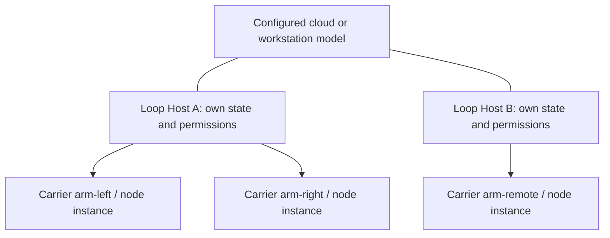

# Multi-carrier deployment

Loop can use one portable manifest on multiple hosts. Each host starts only its assigned carriers, with its own runtime state, permissions, node instances and evidence. Existing model/provider configuration supplies the external brain; the same model endpoint may serve several hosts.

This release implements local carrier routing and host-specific configuration. It does **not** establish a network control connection between hosts. Remote assignments are visible as `remote_unconnected`; commands to them are rejected.

## Start two host profiles

The supplied [two-host example](../examples/deployments/two-hosts.json) assigns two simulated arms to `bench-a` and one to `bench-b`. From a source checkout on the corresponding machines (for an installed package, copy the manifest and use its actual path):

```bash
# Host A: node console does not require model setup
loop node --deployment examples/deployments/two-hosts.json --host bench-a

# Host B: same manifest, different local identity
loop node --deployment examples/deployments/two-hosts.json --host bench-b
```

For the normal conversational agent, omit `node`. Existing `--config PATH` and provider/key management still apply. No API key belongs in the deployment manifest.

Without `--state-dir`, each deployment/host uses a separate directory below the existing runtime state directory: `deployments/<deployment_id>/<host_id>`. With an explicit state directory, it becomes bound to one deployment/host; a different host cannot reuse it. The selected manifest is saved as `deployment.json`, so later `loop --state-dir PATH` and the task service see the same binding. Updating a profile keeps a backup; an active task supervisor must stop before the binding changes.

Loading a manifest does not start devices, infer calibration, or replay commands. Node lifetimes remain owned by the current terminal; exiting it stops its local nodes. This is not a new system daemon or remote fleet service.

## Operate a carrier

```text
/carrier list
/carrier start arm-left
/carrier status arm-left
```

Start returns an instance ID. Wait for `node.state=running` and a fresh heartbeat before commanding it. Copy the actual current instance ID:

```text
/carrier move arm-left ACTUAL_INSTANCE_ID 0.2 -0.1
/carrier status arm-left
/carrier stop arm-left ACTUAL_INSTANCE_ID
```

`ACTUAL_INSTANCE_ID` is a placeholder, not a valid example ID. `move` currently means two simulated joint angles in radians. Its acceptance receipt is `queued`; success is established only by the corresponding `command_id` result and Review in status. It does not move the existing GUI viewer.

The model tools are `carrier_list`, `carrier_status`, `carrier_start`, `carrier_command` and `carrier_stop`. Every control call has an explicit carrier ID. Commands additionally require the current instance ID and a caller request ID. The same request ID with the same payload returns the original receipt without re-enqueueing; reuse with different arguments fails. If the first dispatch loses its acknowledgement, retry returns `inconclusive` and requires inspection instead of repeating the action. CLI invocations generate a new request ID for each new user command.

A restart creates a new instance ID. Old commands and old stop requests are rejected, even if the logical carrier name is unchanged. A node manually started under a reserved carrier node name cannot be silently adopted by the carrier router. Request deduplication is bounded to 4,096 keys per terminal, and is not a durable network exactly-once protocol.

## Manifest and adapter boundaries

```json
{
  "version": 1,
  "deployment_id": "robot-lab",
  "hosts": ["bench-a"],
  "carriers": [
    {"id": "arm-left", "host": "bench-a", "label": "Left arm",
     "adapter": "sim_arm", "config": {}}
  ]
}
```

IDs are stable lowercase identifiers; labels are display text. The core validates identities and assignments, while trusted adapters validate their own parameters. Duplicate local physical resources are rejected before startup. The current installed adapters are:

| Adapter | Capability | Limits |
| --- | --- | --- |
| `sim_arm` | Independent MuJoCo two-joint simulation; move and reviewed result | Empty config; packaged model; not GUI control or a real arm driver |
| `serial_rx` | Persistent serial receive observations | Explicit discovered port and baud; no transmit, motor enable or motion; current node config expects Linux USB paths |
| Other names | Listed as `adapter_not_installed` | Manifest text does not install a driver or grant a capability |

Serial example config, to replace only with a verified local device path and baud: `{"port":"/dev/serial/by-id/ACTUAL_DEVICE","baud":115200}`. No unknown motor is assigned a protocol by default. Mobile bases, humanoids and other arms require their own adapter, units/limits, calibration and local protection tests; RoboClaw's type names are not imported as working Loop drivers.

Carrier tools and existing Node tools both enforce their permission rules. Plan mode blocks starts/movement; the underlying simulation/serial restrictions remain. Persistent-task policy currently rejects carrier mutation grants, and legacy scheduled calls reject carrier routing. Task-to-carrier binding and network scheduling are separate future work.

## State and learning separation



There is no implemented control link from Host A to Host B in this diagram. Each host talks to its configured model and controls its local adapters.

Learning scopes add deployment ID, host ID and local profile fingerprint. Configuration changes therefore do not silently reuse observations from the old deployment profile. Carrier receipts preserve carrier/host/instance/request identifiers. Notes within one host are still advisory; there is no claim that calibration or learned control parameters transfer across carriers. No default fleet-wide learning synchronization is enabled.

Validation and reference comparison: [OpenClaw / RoboClaw / nanobot report](../../projects/reports/20_robot_multi_carrier_deployment.md). The tests use independent local processes and MuJoCo on one Linux machine. Cross-machine networking, ARM boards, Windows/macOS hardware adapters and real motors have not been validated by this change.
