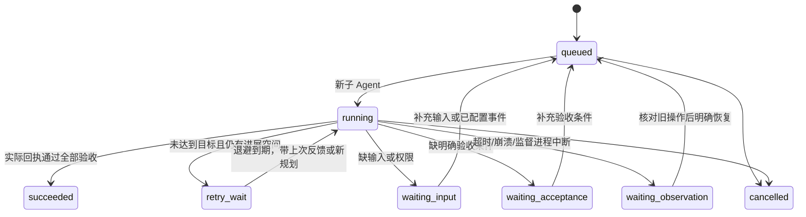

# 持久任务、反馈循环与负责进程

交互终端中，空输入时按 ←/→ 或输入 `/tasks` 打开当前运行任务面板（仅 running，任务结束后自动移出）；↑/↓ 选择查看、取消，Enter 执行，Esc 关闭。切换任务不改变执行状态。完整键位见 [终端规范](TERMINAL.md)。

Loop 的任务完成条件是配置的验收项得到实际工具回执支持，不是模型说“完成”、进程退出或打开了仿真窗口。MuJoCo 只是工具之一，普通 Agent 修改不操作它。

## 进程分工

| 部件 | 负责内容 | 生命周期/入口 |
| --- | --- | --- |
| 交互终端 Master | 接收目标、提交/查看/取消任务、向用户解释反馈 | `loop`；退出不结束独立监督进程 |
| Task supervisor | 队列、重试、验收、定时器、触发器、子进程 broker | `python -m terminal.task_service --state-dir ...`；`/tasks start` 启动，`/tasks stop` 停止；PID/心跳可查 |
| TaskWorker 子进程 | 依据目标、验收条件和上轮反馈执行一轮，再报告下一步 | 监督器按需启动独立 multiprocessing 子进程；每轮有单独 PID/agent_id |
| TaskScheduled 子进程 | 配置的定时/事件任务 | 独立较窄工具白名单，不能递归提交新任务或修改权限 |
| Loop Node | 设备/运行时插件的常驻执行进程 | 既有 `/node`；与 LLM 子 Agent 和监督器不同 |
| 旧前台 Scheduler | 兼容 `/after`、`/every`、`/jobs` | 仅终端打开时执行；新后台周期任务使用下面的配置，不暗中迁移旧任务 |

默认配置：[task_runtime.json](../task_runtime.json)。状态目录存在同名配置时优先使用它，`/tasks config` 显示实际路径和内容。配置更改后 `/tasks stop`，待 `/tasks` 显示进程停止，再 `/tasks start`。配置不包含凭据、shell 命令或可执行 Python；凭据复用当前提供商的现有入口，内存 Key 仅通过子进程环境传递，不写任务账本。

`task_service.lock` 保证同状态目录只有一个监督进程；`tasks.sqlite` 保存任务、工具意图/回执、评审、触发事件、定时游标和进程心跳；`task_agents.jsonl` 保存子进程事件；`task_service.log` 保存进程错误。`/tasks status ID` 查看它们关联的任务反馈。Linux 核对 PID、argv 和进程启动标识，本轮实机验证为 Linux；没有安装 systemd/开机自启服务。

## 状态与继续条件



等待状态都是**未完成**，不是成功，也不自动丢弃。默认每轮 180 秒、最多 2 个并发子 Agent；失败重试从 5 秒退避到 300 秒；连续 3 次验收结果没有变化先派发只读 TaskReplanner 重新规划，再派执行子 Agent 按新方案继续；不会仅因失败次数就结束任务。不同轮次观察值改变会重置停滞计数。没有全任务“达到轮数就算完成”的规则。

每次调用先记录 tool_intent，再记录工具原始结果 tool_result；每轮保存 review、worker_result、下一步和未满足条件。新子 Agent 接收这些反馈修正方案。文字回报不作为验收回执，失败/取消后的迟到结果不能覆盖 cancelled。进程中断可能留下已执行但未回执的操作，因此恢复时先等观察核对，不盲目重放。人可以 `/tasks resume ID 补充信息` 继续，`task_resume` 还可补 checks。

## 使用

- `/task 目标`：直接提交持久任务；无 checks 可先由 Worker 收集信息，但最终会等待明确验收，不能据文字自动完成。
- `task_submit(goal, checks)`：Master 使用的结构化提交工具。
- `/tasks`：查看进程与任务状态；`/tasks status ID`：查看逐步反馈。
- `/tasks resume ID [补充信息]`：恢复等待中的任务；`/tasks cancel ID`：取消后续执行，不回滚旧动作。
- `/trigger EVENT` 或 `task_signal`：发出配置中已启用的命名事件。

验收条件目前支持工具名、点分字段路径、精确期望值，以及可选的精确 arguments 匹配。例如只读核对驱动接入状态：

```json
{
  "goal": "只读核对是否已接入电机发送驱动，不连接设备或操作仿真",
  "checks": [
    {"tool": "robot_toolchains", "path": "integration.motor_write_drivers", "equals": "not_implemented"}
  ]
}
```

验收条件必须对应目标。`window_open=true` 只能证明窗口打开，不能验收抓取；`review.verdict=pass` 还必须对应所要求的动作/测量，可加 arguments 约束。通用自然语言目标的语义正确性仍不能只靠字段检查保证；缺少可执行验收时保留 waiting_acceptance，不制造成功条件。当前不是自动训练、自改权重或任意代码自修改系统。

普通前台对话不再自动交给监督器，失败请求也不因关键词自动创建后台任务。使用task_submit或/task明确提交目标与checks；配置中的旧auto_handoff和success_profiles字段只兼容读取并忽略，不会重新启用隐式交接。已有持久任务的监督、调度、恢复、取消与反馈不受影响。

## 定时与触发配置

配置文件内有默认关闭的示例。`schedules` 每项包含 `name/enabled/every_s/task`，`triggers` 包含 `name/enabled/event/task`。task 是上述 goal/checks 对象。`worker_tools` 为普通任务工具，`scheduled_tools` 是其子集；两者仍受 PermissionGate 的 plan/allow/ask/deny 和真机约束限制。不能配置子 Agent 递归管理、权限写入或技能写入工具。

同一个规则只有一个未完成任务，重复事件或定时到期不会堆出并发重复任务。不同规则互不合并。重启后到期定时器只产生一次任务并从当前时刻排下次，不补放所有漏过的周期。事件消费和任务创建在同一 SQLite 事务内完成；事件 payload 存为数据，不插值成命令。

后台进程可以在规则启用时轮询 `/dev/serial/by-id` 目录，发出 `serial.appeared` / `serial.disappeared`。只观察设备路径变化，不打开串口、不猜协议或使能电机；启动时已有设备仅建立基线，不伪造新插入事件。其他事件由 `/trigger` 或 `task_signal` 明确输入；未实现任意文件/ROS topic/网络事件的通用监听。

## 验证与边界

`tests/test_task_supervisor.py` 覆盖独立进程两轮反馈修正成功、纯文字“完成”被拒绝、缺输入/验收等待、取消/进程中断不重放、定时/事件去重与显式任务提交。真实用户配置模型已在独立监督进程中执行 robot_toolchains，通过字段验收：[真实运行证据](../artifacts/terminal/task_service_validation.json)。这证明进程和验收通路工作，不证明所有机器人任务都能自主完成。

测试时设 `LOOP_TASK_AUTOSTART=0`，防止测试中的失败请求意外启动真实模型服务；进程级测试使用独立替身 Worker 验证反馈驱动第二轮，而非调用外部 API。无需新增第三方依赖。本次实现不修改场景状态，因此没有重启 MuJoCo。

后台状态变化会写入终端 Task feedback；Master通过task_status按需获取状态和评审；用户也可查看/tasks status ID。

执行子进程在尚未调用任何工具前遇到模型/网络错误，可以退避重试；一旦已有操作且后续中断，未通过验收的任务等待观察核对。若全部实际验收回执已齐全且没有悬而未决的工具意图，即使模型最终文字回复失败，也可依据证据完成任务。完整目标不会为塞入上下文而静默截短，超过单轮上下文上限会保留任务并要求拆分。
