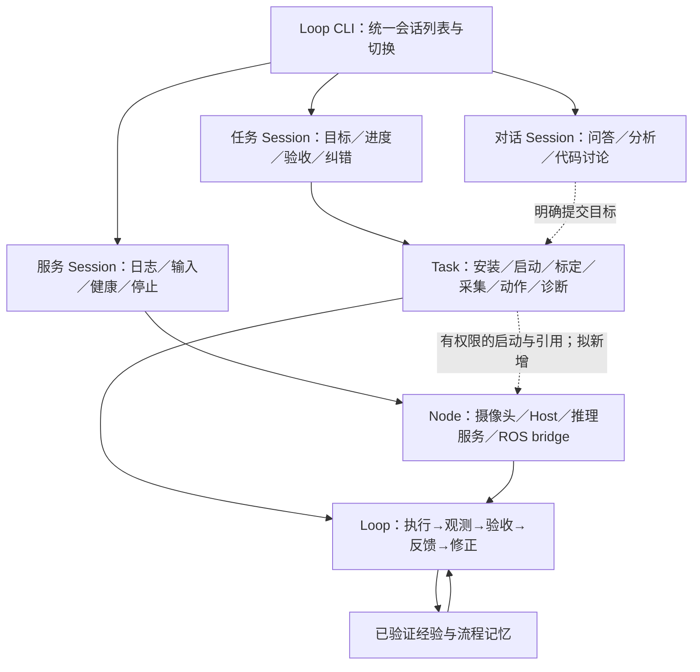

# Session、Task、Node 统一工作台设计

日期：2026-09-07。范围：依据本项目源码讨论产品结构，不实施运行时或键位修改，不执行设备动作。

## 结论与建议

用户界面统一称 Session（会话），分为对话会话、任务会话和服务会话。类型是展示与默认交互方式，不是互斥的底层进程类型；对话可以关联任务，任务可以引用服务。底层保留 Session（历史/焦点/队列）、Task（目标/验收/反馈）和 Node（持续执行/资源/健康）三个职责。

Node 可以在 UI 中作为长期服务任务展示，但不合并底层生命周期与成功定义。启动相机 Task 可在收到新鲜有效帧后成功；相机 Node 仍持续运行。采集一批数据 Task 可借用它，保存满足质量条件的数据后完成；关闭采集不应默认停止其他任务共享的相机。

其他工作类型属于标签或验收模板：安装构建、观察监控、录制回放、标定评测、模型推理、机器人动作、诊断修复、定时巡检。无需为每一种新增运行时。既有 ROS 工具不等于已实现持续 ROS Node；当前没有专用相机 Node，process 可承载已有相机程序，但不自动提供图像显示、帧 API 和专用健康检查。

## Ctrl+C 设计建议

当前焦点会话的第一次 Ctrl+C 停止当前工作，不退出整个 CLI：

- 对话会话：取消当前模型生成，停止消费本会话队列；队列标记暂停并保留，只有显式恢复才执行。保留草稿。
- 任务会话：先取消任务调度、阻止下一步与新动作，再取消当前执行；仅停止任务独占且配置随任务结束的 Node。共享或显式保活服务保留。
- 服务会话：走 Node 停止协议，包含可能存在的远端停止命令，并展示停止回执。尚未确认时显示 stopping／unknown，不伪报 stopped。

空闲会话 Ctrl+C 可清空草稿或提示已停止；退出使用明确 `/exit` 或 Ctrl+D，避免第二次误按关闭其他会话。全局停止是独立操作。软件取消不能证明实体机器人停稳，机器人适配需停止协议与实际状态回执。以上是建议，现有 Ctrl+C 尚未改动。

Task–Node 引用需要记录 owner、使用者、独占/共享与停止策略。用户取消优先于自动修复；恢复不得自动重放副作用不确定的操作。

## 反馈闭环与 Token

每个 Task 保存目标、验收条件、实际观测、原始工具回执、判定（通过/未通过/证据不足）、失败原因、下一步与尝试记录。运行成功和业务成功分开：PID 存在、端口开放或脚本退出 0 不能单独验收机器人动作。

例如“启动相机并达到要求帧率”：检查设备身份、连续新鲜帧、配置要求的分辨率/帧率和窗口内丢帧指标；如果没有达标，依据真实错误处理。服务任务达到 ready 后进入低成本监控，异常再产生诊断工作，不把长期健康永久记为已成功。

建议修复层次：已验证、适用且已授权的确定性处理 → 必要时检索相关经验 → 无适用方案时调用模型诊断 → 执行后重新验收。已知方案也要检查前置条件、风险与是否适用；改变 IP 或机器人目标按已有规则提示回退，不能静默换设备。

健康采样由程序完成，事件聚合、去重、退避；普通心跳不送模型。模型仅处理新目标、异常或确需规划的情况。重试须有进展检查、成本预算和等待条件；用户取消、缺权限、目标不明或未知副作用时不自动继续。重复成功的相同流程可沉淀带适用条件与停止条件的候选流程，三次成功不自动扩大机器人动作授权。

## 已有能力与缺口

已核对：Session 保存历史与任务归属；TaskSupervisor 使用真实回执验收，保存反馈，退避重试，连续三次无变化重新规划；中断且可能有未知副作用时等待观察。进程 Node 已支持无模型轮询的本地/SSH 程序、日志尾部与行输入。

尚未实现：统一多类型 Session 切换、按焦点 Ctrl+C 停止、跨监督器的 Task–Node 所有权/依赖协议、专用相机 Node 与健康验收、通用的规则优先自动修复。当前后台 Task 工具边界不能直接管理 Node，进程 Node 随 CLI 退出回收，而 TaskSupervisor 可独立存活，不能仅改名字宣称已打通。

## 来源与验证

本地事实来源：[Task 规范](../TASK_RUNTIME.md)、[监督器](../../terminal/task_supervisor.py)、[终端 Ctrl+C 与会话切换](../../terminal/interactive.py)、[NodeRuntime](../../core/nodes.py)、[进程工作流](../PROCESS_NODES.md)。未引用外部资料。

验证状态：只读核对上述代码与文档，图与方案为设计推断；本轮未改实现、未运行硬件、未验证完整自主机器人闭环。
