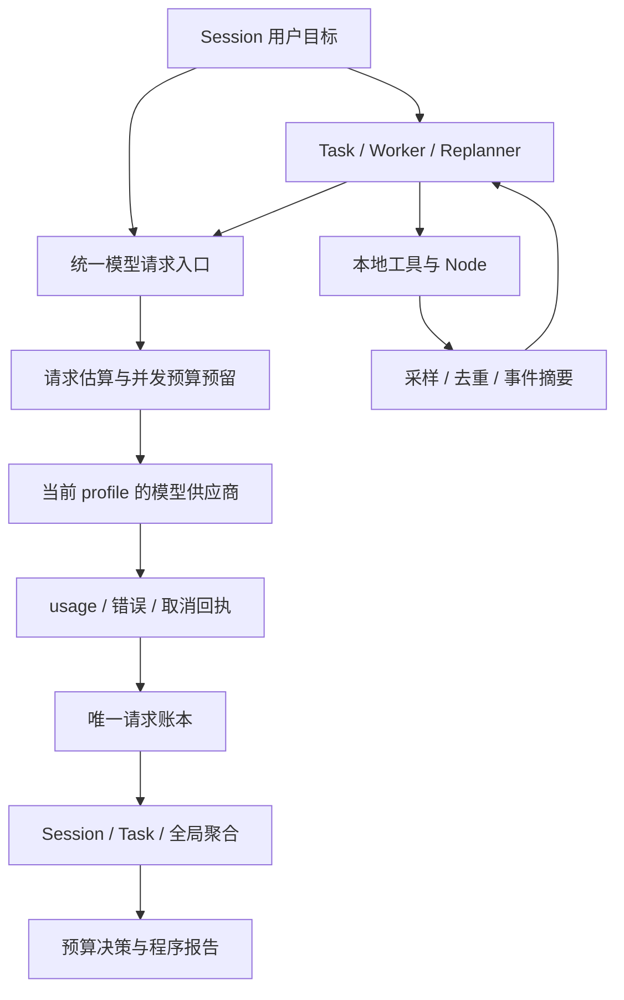

# Loop ROS 全系统 token 计量与节约方案

日期：2026-09-07。范围：当前 Loop ROS 源码、前台会话、Task/子 Agent、记忆、搜索和机器人 Node。状态：已核对代码及官方文档；本轮落实三次重新规划与只读检索，其余分阶段设计尚未全部实现。未调用用户的付费模型，未测量用户账单，不宣称实际节约比例。

## 1. 目标和本轮落地

让模型用在诊断、修复和必要的新方案上；程序负责等待、状态采集、验收和报告。评价标准是“每个验收成功任务的总成本”，同时观察成功率和完成时间，不能只追求单次请求更便宜。

- 默认 `max_replans=3`、`max_attempts=9`。连续三次相同验收失败后，最多三组重新规划及执行验证；没有变化的路径合计为 `3 + 3 × 2 = 9` 次尝试。出现进展时不强迫用满预算；总预算仍有效。
- 重新规划可读取相关文件和搜索官方资料，工具范围取原任务已获授权的只读子集。定时任务使用独立 TaskScheduledReplanner，不继承手动任务工具权限。
- 重新规划按报错决定是否检索，不强制依次“猜测、读代码、联网”；每次提出不同假设、最小修改和验收步骤。
- 原有停滞判断、退避、实际回执验收、文件备份、等待不启动 Worker、确定性报告继续保留。
- 9 次尝试是默认上限，不是 9 次 API 调用，也不是精确 token 上限；已有用户显式配置优先，不静默改写。旧文件缺少新字段时使用新默认值。运行中的监督器需重新加载配置。

## 2. 当前能力与计量缺口

| 环节 | 当前代码及事实 | 尚需补齐 |
|---|---|---|
| API 回执 | [llm.py](../../terminal/llm.py) 接收 Chat/Responses usage；Chat 流读取 usage 尾包 | HTTP 失败、取消、无法解码及 incomplete 响应可能在记账前退出，需在传输层登记 |
| 前台累计 | [token_budget.py](../../terminal/token_budget.py) 累加 input/output/total，缺报有标记；[session.py](../../terminal/session.py) 保存恢复 | 目前不是全系统总账；没有缓存读写、推理明细和模型实际切换后的费用归属 |
| 上下文 | [context_window.py](../../terminal/context_window.py) 先筛历史；token_budget.fit 再按协议请求估算、压缩 | 前者是字符预算，后者是 UTF-8 字节保守估计，均不等于真实 tokenizer 计数；图片额度也只是配置假设 |
| 前台模型循环 | [conversation_context.py](../../terminal/conversation_context.py) 配置每段 24 个工具轮次，近期有新回执时最多续接两段（上限 72），另有一次收尾 | 完成一轮用户对话可能有多次请求，不能按消息条数计费 |
| Task/子 Agent | [agents.py](../../terminal/agents.py) 中 Worker 创建 ChatAgent；默认 4 个工具轮次加收尾，可能另处理补充消息 | 子进程的 usage 尚未经 IPC 汇总到 Task、Session 和全局；不能把前台 Tokens 当总消耗 |
| 监督器 | [task_supervisor.py](../../terminal/task_supervisor.py) 有轮数、超时、停滞和退避控制 | 缺少请求级 token/费用总预算、并发额度预留、已尝试方案的结构化去重 |
| 记忆 | [learning.py](../../terminal/learning.py) 本地检索、去重及截短；相关记录集合约束 3000 字符，另有指导文本 | 不能把本地检索时间算作模型 token；召回文本进入下一次请求才计入输入。当前 context_provider 可在同轮重复检索 |
| Node/机器人推理 | 进程运行、日志、健康检查、控制循环独立于聊天模型 | 应单列 GPU 秒、帧数、动作步数和服务费用；OpenPI 等机器人策略运行不按聊天 token 虚报 |
| 自动报告 | [tasks.py](../../core/tasks.py) 程序生成状态及逐项验收概要 | 尚无完整 token/费用报告；报告生成本身无需模型 |

本地静态取样：默认前台 COMMON 工具 39 个，工具 schema 紧凑 JSON 为 **16,290 UTF-8 字节**；TaskWorker 注册工具 32 个为 **14,997 字节**；重新规划可选的四个只读工具为 **1,461 字节**。这些是源码快照的字节量，不是账单 token；未包含 task_feedback、运行时附加工具、完整系统提示和用户配置。它们说明应优先测量工具定义的重复输入开销。

## 3. 统一计算口径

每一次真实 API 请求都单独记账，使用请求唯一标识，包含所属 Session、Task、Agent、尝试编号和目的。重试产生新请求，不能按相同提示哈希合并费用。

对请求 i 定义：

- `Iᵢ`：供应商报告的输入 token；包括系统提示、工具 schema、历史、记忆、当前输入、已回传工具结果和多模态输入的供应商计量。
- `Oᵢ`：供应商报告的输出 token；包括输出的工具调用参数。推理明细 `Rᵢ` 是输出中的分类，不能再加一次。
- `Hᵢ`：缓存命中的输入 token；属于 `Iᵢ`，不是额外 token。
- `Wᵢ`：供应商单独报告的缓存写入分类；根据该供应商的字段和价格语义计价，不能套用固定倍数。
- `Tᵢ = Iᵢ + Oᵢ`；任务总量为所属唯一请求的 `ΣTᵢ`。全局按唯一请求聚合，不再把 Session 汇总与其子 Task 汇总相加。

Chat Completions 的 `prompt_tokens/completion_tokens` 与 Responses 的 `input_tokens/output_tokens` 归一化；同时保留原始 usage 字段和供应商口径。Responses 还有缓存读写和推理明细。[OpenAI API usage 定义](https://developers.openai.com/api/reference/cli/resources/responses/methods/create)

推理 token 已计入输出，应单列展示而非叠加计费；控制输出长度时也应考虑推理模型的预算需求。[Reasoning models](https://developers.openai.com/api/docs/guides/reasoning)

**费用与 token 分开。** 对普通输入、缓存读取、缓存写入互斥分类的供应商，可计算：

```text
请求费用 = ((I − H − W) × 普通输入单价
          + H × 缓存读取单价
          + W × 缓存写入单价
          + O × 输出单价) / 1,000,000
          + 搜索等工具费用
```

若供应商把写入价格定义为附加费，则使用对应适配公式。未报告分类不能随意当作零；价格未知则费用显示 unknown。价目表按 endpoint 标识、实际 model、service tier、币种、生效日期保存。用户自定义中转站的价格、缓存及 usage 真实性以其回执和账单为准，不能直接套用 OpenAI 官方价格。

缓存的主要收益是减少费用和延迟，并不会让已处理的 token 从统计中消失。是否划算必须同时计入缓存写入和命中收益；本方案不自动启用特定缓存参数。[Prompt caching](https://developers.openai.com/api/docs/guides/prompt-caching)

**缺报不等于免费。** 展示已报告合计、估计合计、缺报请求数和未知费用。断流、超时或取消后供应商仍可能已执行计算；保留已收到 usage，未收到则记未知，不凭本地异常声称费用为零。估算不冒充真实账单。

## 4. 建议的系统账本与预算链路



以下为待实现设计，不是已有工具或命令：

1. 在真正发出 HTTP 请求之前写 `request_started`，记录估算及预留。在拿到原始 usage 后立即记账，再解析业务内容；解析失败也不丢已知费用。
2. 使用 SQLite 请求账本及事务预留；Worker 经 IPC 发送用量事件，由监督器持久化。每个请求以 `request_id` 幂等结算，累计 snapshot 不能当增量反复相加。崩溃和重连后仍能对账。
3. 最小记录：本地 request_id、供应商 response/request_id（如有）、父级身份、实际 endpoint 标识/model/tier、purpose、时间、估算、原始 usage、状态、价格版本。只存必要计量字段，不存密钥或完整提示。
4. 目的分类：聊天、执行、重新规划、搜索决策、记忆整理、视觉分析、收尾。调用搜索工具本身的费用另列，其返回文本在后续模型输入里正常计量。
5. 汇总提供按 Session、Task、模型、日期和目的的分组；显示 token 总量、缓存命中率、缺报率、费用、成功率、每次验收成功的成本。
6. 预算分请求、Task 周期、Session 和用户级。请求前在所有层原子预留“输入估计 + 最大输出”；完成后实际结算，未知请求保留暂估债务。资源排队不消耗 token 额度。
7. 接近软预算时减少回传内容和无收益检索；硬预算不足则不发下一次模型请求，生成报告。供应商硬额度才是最终费用边界，本地估算和取消机制不能保证零超额。
8. 已有确定性停止保护、紧急停止、日志采集和报告不依赖模型预算。预算耗尽不等于自动杀死所有服务；设备按各自生命周期与本地安全策略停止或保持安全状态。

## 5. 按收益排序的节约策略

| 优先级 | 做法 | 为什么有效 | 边界 |
|---|---|---|---|
| P0 | 健康检查、超时、端口等待、验收、报告用程序处理 | 减少模型请求数，长期 Node 可无聊天 token 运行 | 有新的未知故障才唤醒模型，不能让模型承担高频控制 |
| P0 | 全系统请求账本，覆盖后台及失败请求 | 找到真实大头，防止“前台省了、后台失控” | 尚待实现，当前统计不能代表账单 |
| P0 | 工具回执按类型提取关键字段、错误尾部、变化和证据路径 | 避免大日志在每个工具轮次重新发送 | 原始日志保留；异常和安全字段不可被普通截断策略丢掉 |
| P1 | 按阶段加载小工具集合，已加载集合排序稳定 | 降低 schema 重复输入，利于稳定前缀缓存 | 保留能力索引与按需发现，不能省掉必要工具导致更多失败 |
| P1 | 同一 Task 传目标、约束、未通过验收、已排除方法及最近差异 | 避免复制整段 Session 和每轮重复解释 | 不能删掉用户纠正、权限和最近动作的未确认副作用 |
| P1 | 稳定提示和工具定义放前部，动态状态放后部 | 增加可复用前缀的机会 | 以实际 cached_tokens/费用验证，不为凑缓存阈值填充内容 |
| P1 | 记忆按相关性检索，小摘要加来源引用；同轮缓存检索结果 | 本地检索便宜，反复把全部记忆塞进模型昂贵 | 配置、用户纠正或状态变化后失效；不把旧成功当当前状态 |
| P1 | 联网针对“报错 + 版本 + 接口”的具体缺口 | 一次有效检索可能替代多轮猜测 | 同错误和版本复用已检索资料；网络错误不无限重搜 |
| P2 | 简单状态用模板，复杂诊断才用较充分推理 | 不为每次进度消息做长推理 | 不自动切换用户 profile；新模型能力和价格须验证 |
| P2 | 图片只传与故障相关的关键帧、合适分辨率 | 避免连续视频帧形成巨量输入 | 视觉质量不足导致误判时应提高质量；本地安全仍靠实时反馈 |

这些优化应同时观察延迟、成本和正确率；流式输出改善体验，但不自动减少 token。并发可缩短时间，也可能提高总成本，不能把更多 Agent 当作节约措施。官方也将减少调用和用传统程序完成确定性操作列为优化方向。[Latency optimization](https://developers.openai.com/api/docs/guides/latency-optimization)

## 6. 三次重新规划怎样用得值

建议后续增加结构化尝试记录：`错误类别、标准化错误指纹、源码/配置版本、已有假设、被否定假设、证据 ID、变更摘要、未通过验收项`。错误指纹排除时间戳和随机 PID，但保留会影响诊断的版本、错误码和设备身份。当前停滞判定仅基于验收结果指纹，这一增强尚未实现。

| 报错类型 | 自动处理方向 | 何时换方案/搜索 |
|---|---|---|
| 明确配置/路径/语法错误 | 对照代码和现存配置，最小备份修改再验证 | 同一修复失败就检查依赖与调用链，不重复原修改 |
| 新版本接口/协议不兼容 | 确认版本与实际响应，检索官方接口和已知问题 | 缺少版本资料时搜索，保留 URL 与关键适用条件 |
| 临时网络/限流 | 程序退避、服务状态检查 | 没有新信息的超时不值得连续重新规划；仍受总预算约束 |
| 权限/缺少工具/凭据 | 明确指出缺项，等待条件变化 | 不能靠换提示绕过权限，不能搜索或暴露凭据 |
| 动作副作用不明/反馈过期/力矩故障 | 本地停止并核对真实状态 | 不作为普通可自动重放的软件失败 |

建议检索预算初值：每次重新规划最多两条有差异的查询、读取最多两个最相关官方页面；只回传相关片段，完整页面留引用。该查询次数上限尚未硬编码，现阶段受模型工具轮次和 Task 总预算约束。

## 7. 可计算的样例与验收指标

以下仅为预算演算，不是实测收益或默认配置：

| 假设情境 | 请求次数 | 每次平均输入 | 每次平均输出 | 总 token |
|---|---:|---:|---:|---:|
| 未精简上下文，完成相同工作 | 25 | 12,000 | 1,200 | 330,000 |
| 6 次执行尝试，各 3 个请求 | 18 | 4,000 | 800 | 86,400 |
| 3 次重新规划，各 2 个请求 | 6 | 3,000 | 600 | 21,600 |
| 最终用户解释（可用程序报告省去） | 1 | 2,000 | 600 | 2,600 |

优化情境合计 `86,400 + 21,600 + 2,600 = 110,600`，相同请求数下示例减少约 **66.5%**。实际要用请求账本替换这些假设，且只有成功率、验收质量和停止可靠性不下降时才算收益。缓存价格变化还会让费用比例不同于 token 比例。

建议验收：

- 混合前台、两种后台来源和多个 Session，各请求恰好计一次；子任务聚合与全局账本对得上。
- usage 缺失、流中断、incomplete、取消、进程崩溃均保留未知或部分用量；不显示假零费用。
- 同时启动多个任务时，事务预留不超发；等待和生成报告不触发额外模型调用。
- 中文、长代码、多工具定义、图片分别验证估算误差；保护当前目标、纠正信息和完整工具调用/回执配对。
- 比较固定任务集的成功率、每成功任务 token/费用、P50/P95 延迟、重复无效请求率、缓存命中率和缺报率。先收集基线再设节约目标。

## 8. 实施顺序与当前验证

第一阶段：统一请求账本、Worker IPC 用量上报、缓存/推理分类和缺报统计。无需先改 UI，也无需换模型。

第二阶段：全局与 Task 预算预留、上下文各部分开销归因、工具结果投影、按阶段工具加载、同轮记忆检索复用。

第三阶段：错误指纹及方案去重、检索缓存和查询上限、成功流程复用，最后才评估模型分工和自适应推理预算。

## 9. 按用途选择模型，而非每步固定调用全部模型

2026-09-07 补充：用户要求轻量附加任务使用较弱模型，规划、编码、反馈和复杂故障分析分层。该需求作为路由设计约束；不是要求所有流程经过一条固定的多模型流水线。

| 用途路由（拟定） | 默认能力层 | 输入与产物 | 调用条件 |
|---|---|---|---|
| title | 本地规则优先，轻量模型补充 | 首条请求、最新实质请求、必要目标摘要 → 短标题 | 实质目标变化后异步生成，绝不阻塞输入 |
| understand | 轻量模型或当前工作模型顺带完成 | 当前请求和最少历史 → 目标、约束、所需能力 | 明确的一步请求直接执行，避免额外分类调用 |
| plan | 中高能力模型 | 目标、依赖、已知约束 → 简短步骤及验收 | 有依赖或明显不确定性才独立规划 |
| code | 用户配置的主力编码模型 | 相关代码片段、接口和测试 → 修改及验证 | 正常实现、修复；不重复传整个仓库 |
| feedback | 程序验收优先，轻量模型解释 | 结构化回执、diff、测试结果 → 简短反馈 | 程序结论足够就不请求模型；模型文字不改验收状态 |
| diagnose | 用户允许且经验证的最强适用模型 | 错误链、已排除假设、相关源码、失败验收 → 新假设及检查 | 复杂根因、跨系统故障、有效修复失败后升级 |
| retrieve | 本地检索优先，轻量模型可辅助排序 | 文件名、目录摘要、工具名称与说明 → 候选路径/工具 | 语义不明确时排序；明确路径直接读 |

“最强”必须指当前允许的模型集合中适合该任务、经过能力验证的模型；不能单凭价格、名称或发布时间推断。OpenAI 也可按这些用途绑定不同 model ID；这里不硬编码某一代模型，不自动把用户密钥发给新的 endpoint。

配置建议：保持现有 profile 管理 endpoint 与凭据引用，新增独立的 `用途 → profile/model → 输出预算/允许工具/超时/后备路由` 映射。映射对象必须区分普通文本、工具调用、视觉与协议能力。能力目录只表示候选，实际兼容性还需验证。此映射尚未成为当前配置 schema，不应直接粘贴到现有配置文件。

已核实：当前 [agents.json](../../configs/agents.json) 的 Planner、Worker、Reviewer、Expert、Reader 均指向 `llm`；[config.py](../../terminal/config.py) 还将旧 expert 入口归一到 llm。已有角色名不等于已有多模型路由。后续应保留兼容入口，显式加入用途路由，不把旧 expert 别名暗改成另一个供应商。

轻量模型只负责有限职责。升级时传递“目标、约束、原始证据引用、已尝试方法、未解决项”，不复制所有中间思考；强模型分析完成后将可执行结论交回编码/执行角色。若轻量模型不支持工具调用，则只返回候选排序或标题，不能直接拥有执行权限。路由、标题生成和升级请求全部进入同一 token 账本，防止附加任务反而增加总费用。

## 10. Session 标题：首条确定目标，末条反映进度

[titles.py](../../terminal/titles.py) 已本地摘取首条和末条用户请求，各最多 28 字符并组合；这是零模型调用的摘取，并不是语义精简。用户手动命名应始终优先。

建议生成规则：

- 标题目标为 8–20 个中文字符左右，不把完整 prompt 当名字。首条保留长期目标，最新实质请求体现当前方向。例如首条“连接 Jetson 检查 host”，末条“修复推理服务 CUDA 错误”，标题可为“Jetson 联调：CUDA 修复”。
- “继续”“好的”等低信息末条不替换主题；若明确改目标才更新，不能仅凭末条丢失原任务。
- 只发送经过脱敏的首条、最新实质请求及必要的一小段目标摘要，不发送完整 Session。首末文本不足理解指代时，先使用本地标题，不为命名递归读取全部历史。
- 本地标题立即显示，轻量模型在回合结束后合并更新；不逐 token、逐按键生成。以输入摘要哈希缓存结果，保持 Session ID 不变。
- 异步结果带版本：只在输入版本仍匹配且用户未手动改名时应用。失败、超时、预算不足均保留本地结果，最多一次生成调用，不循环修标题。
- 模型标题不得成为权限、任务路由或文件名的权威依据，显示前过滤终端控制字符、长度和凭据。缓存及清理跟随 Session 生命周期。

这些异步语义标题机制尚未实现，本轮没有改变现有终端命名或额外调用模型。

## 11. 工具与文档的渐进检索

建议路径为：**名称/项目地图 → 相关候选 → 目录标题/符号 → 命中行附近片段 → 直接依赖和测试**。文件名用于排序，不代表已经了解内容；只有证据不足时才扩大范围。关键词精确搜索和缓存通常无需模型，复杂含义排序才用轻量模型。

工具检索保留稳定的机器名称和参数 schema；可另外维护中英文用途标签、适用场景、最小调用示例、读写副作用、权限及回执字段。模型不能临时翻译或猜测工具名。先看索引，选中后按需加载完整 schema；执行前必须依据已加载 schema，而不是网页中的同名示例。

项目文档先读现有地图的相关条目，再打开权威文件。普通任务通常只需一至三个候选；不要为了“理解项目”把 README、全部文档和所有工具说明一并加载。未命中可扩大候选范围，明确保留“目前只读取片段”的事实。

现有工具已经提供：

- `list_files`：当前目录的名称列表，最多 200 项，带截断标识。
- `search_files`：在限定目录做文本搜索，返回路径、行号和片段；它是全文关键词搜索，不是文件名语义搜索。
- `read_file`：`offset` 是从 1 开始的行号，`limit` 是行数；返回完整文件 sha256、总行数和片段位置，可能带 next_offset 或截断标识。例如 `{"path":"docs/TASK_RUNTIME.md","offset":40,"limit":60}`。

当前 [files.py](../../terminal/files.py) 的分页减少模型输入，但实现仍会先读取本地完整文件再切片；8 MiB 以上文件直接拒绝，缩小 limit 也不能绕过该上限。不要把这称作流式磁盘读取。文件修改前仍须核对当前完整文件哈希和唯一替换上下文。

建议后续为索引加入更新时间及内容哈希，选片段时优先函数/标题边界、错误上下文和调用接口。缓存键包含文件哈希和行区间，文件改变即失效。不要逐行多次读取同一段；单次先取足够解释问题的小块，只有缺依赖时扩展。调用次数、总回传量与误判率一并评估，过小切片也会因额外往返浪费 token。

本轮将“索引优先、按 schema 调用、按需分段、证据足够停止”写入默认 workflow harness。用途模型路由、异步语义标题、语义文件索引是待实现项；已有用户自定义 harness 不会被发行默认值覆盖。

本轮验证命令：`LOOP_TASK_AUTOSTART=0 .venv/bin/python -m unittest tests.test_task_supervisor tests.test_task_autonomy tests.test_token_budget tests.test_task_scope -q`，30 项通过。包含三次重新规划及各自验证、来源工具边界、有限重试、实际代码修复与现有 token 统计回归。网络工具仅核查授权集合，未用用户模型执行联网调试；在线资料通过独立文档工具核对。未接入或验收实机力矩保护。

2026-09-07 后续落地：新增 reasoning_effort profile 字段和 `/reasoning` 命令，按 Chat/Responses 协议发送；正文压缩后的复用引用修正及只读空转收束已实现。当前前台另有 max_tool_rounds=None 设置，已不适用此前前台固定 72 轮描述；后台 Task 总预算与全系统计量缺口仍需分别看对应实现。详见 [模型配置](../MODEL_SWITCH.md) 与 [运行记录](../RUNBOOK.md)。


## 12. 2026-09-07 实际累计用量核查与本次节省措施

本地 conversation.sqlite 中最近会话累计 138 次请求，input_tokens=1,558,611、output_tokens=6,582、total_tokens=1,565,193；更新时间为数据库记录的 2026-09-07 12:40:32。输入占约 99.6%，平均每次输入约 11,294 token。这是会话累计记录，无法据此将全部费用归因于某一次启动或轨迹回放；没有逐任务拆账与缓存计费明细，不能计算精确金额。

工具栏的 local tokens 只估算工具参数和结果，不等于上述模型 usage。UI 折叠不会减少发送给模型的内容。主要浪费风险是重复检查造成模型往返，每次重新携带上下文。

现有读取缓存、正文可见性核对及无新证据空转收束用于减少重复检索。本次把 Python 语法检查合并到 run_python 本地执行入口，并同步 schema、默认 harness 和后台执行提示；模型正常执行无需再单独 python_check。当前哈希和权限检查保留。此项能省去独立语法检查所需的模型往返，但尚未用真实机器人任务测量节省比例，不能宣称 150 万 token 已降到某个值。既有用户自定义 harness 不被默认文件覆盖，已运行 CLI 需正常重开加载代码。

本次隔离回归：工具组折叠/点击关闭/再次展开、中文草稿与颜色 PTY、Python 语法错误不启动子进程、读取循环与 reasoning，共 20 项通过；没有调用计费模型，也没有执行真机运动。
